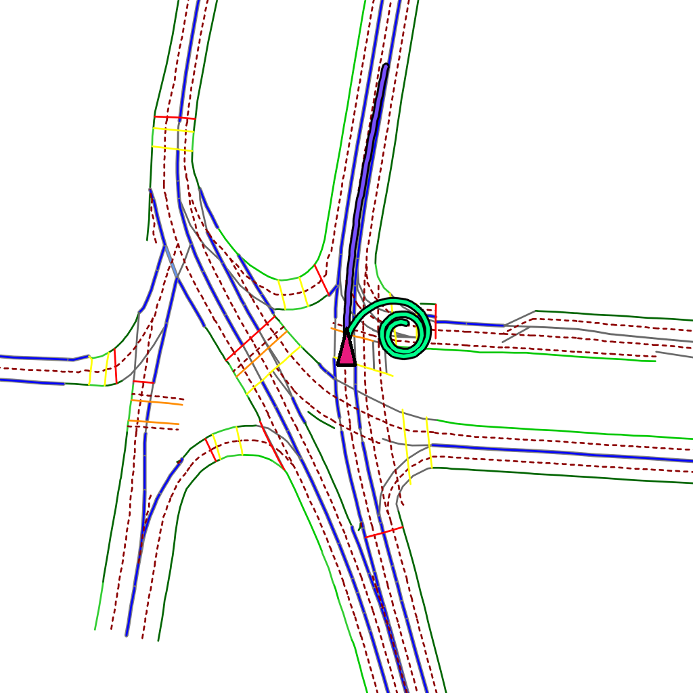
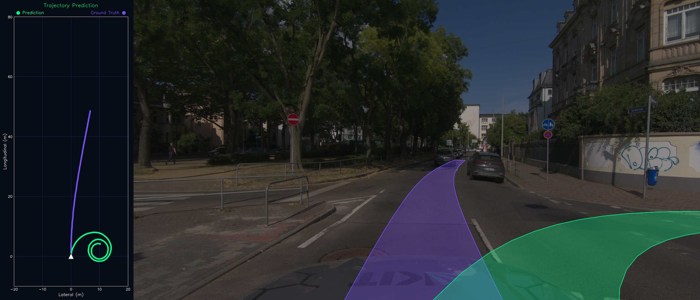

# Trajectory Visualization #

This is implemented as a class. It contains 3 key functions:
* `render_trajectory_map_tile`
* `render_trajectory_on_a_grid`
* `complete_front_camera_view_with_trajectory`
 
Function | `render_trajectory_map_tile` | `render_trajectory_on_a_grid` | `complete_front_camera_view_with_trajectory`
-----|:----:|:---:|:---:
View | Top-Down Map View | Grid View | Front Camera View
Outputs |  |  | 
Description | The top-down bird's eye view of the map tile with the drawn trajectory. | A 2D metric grid with the drawn trajectory. | A camera view with the perspective-correct 3D footprint trajectory drawn.

All the visualization is done using OpenCV, which should *theoretically* allow for effective video generation.

## Usage ##

### `render_trajectory_map_tile`

Overlays the trajectory directly onto a top-down BEV map tile.

* `action_sequence`: A flattened tensor `(128,)` of predicted `[acceleration, curvature]`. This is the exact format outputted by the `model()` function.
* `current_speed`: The ego vehicle's current speed in m/s.
* `map_image`: Must be a map tile, not normalized. If the dataset does not provide maps directly, but provides GPS history, please use the already existing [map generation function](https://github.com/autowarefoundation/auto_e2e/tree/main/Model/data_parsing/map_rendering) to get a map tile.
* `resolution_m_px`: The metric resolution of the map image (meters per pixel).
* `color`: The BGR color tuple for the trajectory line (e.g., `(0, 255, 0)` for green).
* `initial_heading`: The initial heading of the ego vehicle in radians.

**Example Usage:**
```python
from trajectory_visualization.trajectory_rendering import Visualization

map_with_trajectory = Visualization.render_trajectory_map_tile(
    action_sequence=pred_trajectory,
    current_speed=10.5,
    map_image=my_map_tile_bgr,
    resolution_m_px=0.4,
    color=(164, 217, 52), # Green
    initial_heading=0.0
)
```

### `render_trajectory_on_a_grid`

Draws the trajectory on a generated 2D metric grid, useful when a map tile is not available or for analyzing pure kinematic shapes.

* `action_sequence`: The predicted `(128,)` trajectory tensor.
* `current_speed`: The ego vehicle's current speed in m/s.
* `actual_action_sequence` (optional): The target/ground-truth `(128,)` trajectory tensor.
* `prediction_color` (optional): Color for the predicted trajectory. Defaults to `(140, 255, 0)`.
* `actual_trajectory_color` (optional): Color for the actual trajectory. Defaults to `(255, 80, 120)`.

**Example Usage:**
```python
grid_image = Visualization.render_trajectory_on_a_grid(
    action_sequence=pred_trajectory,
    current_speed=10.5,
    actual_action_sequence=target_trajectory
)
```

### `complete_front_camera_view_with_trajectory`

Projects and renders the 3D footprint of a trajectory onto a 2D front camera image using perspective-correct polygons and semi-opaque fill.

* `action_sequence`: The predicted `(128,)` trajectory tensor.
* `current_speed`: The ego vehicle's current speed in m/s.
* `front_camera_image`: The raw, unnormalized BGR camera image.
* `P`: The 3x4 Camera Projection Matrix. If `P` is not provided, you must provide `K` (Intrinsics), `R` (Rotation), and `t` (Translation). It assumes input points to P are in RDF, so if a dataset uses different convention, it has to be converted to RDF.
* `color`: The BGR color tuple for the semi-opaque footprint (e.g., `(52, 217, 164)`).

**Example Usage:**
```python
# Draw target trajectory
cam_view = Visualization.complete_front_camera_view_with_trajectory(
    action_sequence=target_trajectory,
    current_speed=10.5,
    front_camera_image=raw_camera_image.copy(),
    K=K,
    R=R,
    t=t,
    color=(255, 80, 120)
)

# Draw predicted trajectory over the same image
cam_view = Visualization.complete_front_camera_view_with_trajectory(
    action_sequence=pred_trajectory,
    current_speed=10.5,
    front_camera_image=cam_view,
    K=K,
    R=R,
    t=t,
    color=(140, 255, 0)
)

# Optionally concatenate with the grid view
final_view = Visualization.concatenate_grid_and_camera(grid_image, cam_view)
```

## Dependencies ##

To use `Visualization` class, you would have all the required dependencies if you followed the [Autoware E2E installation instructions](https://github.com/autowarefoundation/auto_e2e). No extra packages are needed.

If you wish to run the live visualization script (`--live`) on L2D dataset to test visualization using real records, you will additionally need the [L2D dependencies](https://github.com/autowarefoundation/auto_e2e/tree/main/Model/data_parsing/l2d).

Similarly, to run the KIT Scenes visualization script (`Kit_Scenes_visualization/kit_scenes_visualizer.py`), you will need the [KIT Scenes dependencies](https://github.com/autowarefoundation/auto_e2e/tree/main/Model/data_parsing/kit_scenes) installed.